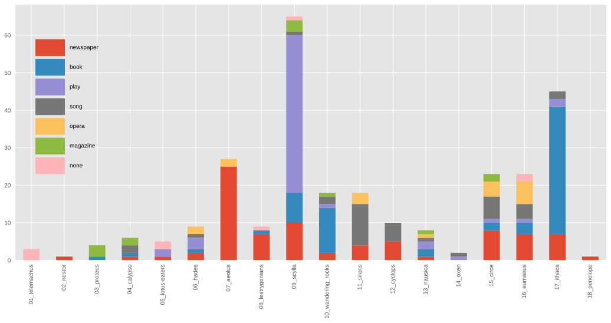

Scholarly editing is commonly the work of specialists. For readers and users, engaging with editions in print has in the past been essentially receptive, i.e., static and noninteractive. This need no longer be so for editions in the digital medium. Open Editions Online offers James Joyce's *Dubliners*, *A Portrait of the Artist as a Young Man* and *Ulysses* for interactive use in progressive dialog. The foundational texts are the reading texts for these works from the scholarly editions prepared by Hans Walter Gabler and his co-editors in 1993 (*Dubliners*, *Portrait*)^[@joyce1993dubliners; @joyce1993portrait] and 1984/86 (*Ulysses*).^[@joyce1986ulysses] To these, our community, comprised of literature professors, Joyce enthusiasts,[^contrib] and university students, has added tens of thousands of annotations, describing the texts, and connecting them to the rich bodies of literary critical knowledge that surround them. We aim to aggregate, organize, and analyze the literary discussions related to these works, and to provide them to the public in a way that is community-owned, open access, and open source.

[^contrib]: Besides the authors, significant contributors to this project have included Ronan Crowley (U Antwerp), Goldie Shen (Columbia U), Sophia Koh (Columbia U), Hannah House (CUNY), Fiona Liu (UC Berkeley), and the 2017 students of Sarah Cole's Columbia University course in James Joyce. More contributors are listed in the projects' GitHub repositories: https://github.com/open-editions.

It is a testament to the highly allusive and intertextual nature of Joyce's works that our editions are by no means the first to attempt to reify their many allusions with hypertext. For _Ulysses_ alone, there is Amanda Visconti's crowd-annotated Infinite Ulysses, John Hunt's Joyce Project, Michael Groden's "James Joyce's _Ulysses_ in Hypermedia," and Heyward Ehrlich's interface demonstration of "The James Joyce Text Machine," among others.^[@viscontiInfinite; (still viewable, but no longer operational) @huntJoyceProject; @groden2001introduction; @groden2004problems; @ehrlichTextMachine] We acknowledge the ingenuity of these precursors, but given their short lives as projects (as perhaps with most digital editions), we endeavor all the more carefully to choose technological systems that will ensure that our textual infrastructures are as robust and future-proof as possible. To this end, we prioritize the creation of a well-structured dataset over a user interface, that is, we value the text more than its packaging. This allows us to concentrate on community knowledge, rather than product creation or curation. To ensure this, we release the work under a copyleft license, thus providing the basis for reuse and remix of our work as responding users see fit.^[The code for the project, the contributed annotations, and other related text are released under the GNU Public License, version 3, unless already under copyright.] Our guiding principles are decentralization, standards-compliance, and distributed versioning. What this means for readers of Joyce is the ability to collaborate with dozens of other Joyceans in creating editions with very broad virtual margins.

Modern digital editions need not suffer from the same limitations as their earlier counterparts, or their print versions. "Web 2.0" interactivity technologies let the user decide what he or she wants to see on a given page, allowing an edition to be simultaneously feature-rich and distraction-free.^[For a good discussion of Web 2.0 technologies and _Ulysses_ editions, see @marino2007ulysses] In Open Editions Online, the texts display several of these features. Among them are *dialog attribution; text genre; language;* and *line numbers.* The categories may be toggled on or off by the reader. The *line numbers* provide elementary orientation for the digital intra-text navigation, as well as for moving between screen and book: for all three of these edited Joyce texts, the line numbers are identical throughout in the respective digital and book publications. *Text genre* and *language* help to gauge the stylistic width of the narrative. *Dialog attribution* serves to identify characters narrated as speaking and to research the intensity of their participation in the narrated events, as well as, for instance, what they are severally and together talking about. We believe this will greatly improve the reading experience, for new and veteran readers of Joyce alike.

Features we are currently developing include markup denoting *cross-references, distinctive words, personal names, locations,* *thoughts* on the part of the narrated characters, and *thematic fields* on the part of the narrative texts themselves. *Cross-references* track leitmotifs and other recurring phrases, such as Bloom's lemon soap (*U* 5.512 and *passim*) or Stephen's "agenbite of inwit" (*U* 1.481 and *passim*). *Distinctive words* show Joycean neologisms, according to a taxonomy that labels them as archaisms, nonstandard compounds, dialect words, and others. *Personal names* tracks the people appearing in the texts, and assigns them unique identifiers, thereby associating characters with their aliases ("Bous Stephanomenos" for Stephen; "M'Intosh" for the man in the macintosh), and linking those characters that appear in more than one work. *Locations* tracks the places mentioned in Joyce's works, differentiating between real and imagined places, and providing latitude and longitude coordinates where possible. *Thoughts* tracks the inner monologues or streams of consciousness of a character, like Stephen's musing about "Chrysostomos" (*U* 1.26). *Thematic fields* comprises, for example, "paralysis" in _Dubliners_, "emancipation from religion" in _Portrait_, or the "Homeric foil" in _Ulysses_. This time-intensive and interpretive semantic enrichment not only provides a richer experience for the reader, but proves useful for computational analysis, as well.

## Analysis

Since our dialog attribution markup is trivially machine-readable, it is easy to extract, for instance, text files that each represent the total speech of a character in _Ulysses_. These files may then be stylistically compared to each other, using techniques of computational stylometry or forensic text analysis. Figure 1 shows the result of such an analysis, comparing the function words of the characters that speak the most, using principal component analysis.^[For the use of function words as stylistic indicators, see @damerau1975use; for a seminal study using this technique, see @burrows1988anna] The axes represent the first and second principal components, and the proximity of points in this space represents the stylistic similarity of those characters' utterances. There are clear affinities in speech style between the co-protagonists Stephen and Bloom, who cluster very closely together; 
similarly among the journalists and literary men Eglinton, Crawford, Hynes, and MacHugh.

Figure 2 shows another type of analysis: a quantification of the titles of mentioned works, arranged by episode and media type. With this visualization, it is possible to see at a glance which episode is most occupied with newspapers ("Aeolus"), books ("Ithaca"), or songs ("Sirens"). While this doesn't reveal anything surprising—critics have long discussed the intermediality of _Ulysses_—it is an example of how ad hoc schematization of the novel is possible with machine-readable markup in TEI XML. Furthermore, as more interpretation is added to the edition, more sophisticated questions may be asked of the data.

Many more varieties of analysis are made possible by our markup, both computational and traditional. Figure 3 shows a subset of some of the places mentioned in _A Portrait of the Artist as a Young Man_. Darker points indicate later positions in the narrative time of the novel. Again, this does not reveal anything unknown to critics, and in fact it is clear from the political divisions here that this is an anachronistic projection, but this nonetheless allows one to see at a glance the geographic movement of the novel's _Bildung_: toward Dublin city.

The sources of knowledge we aggregate are many and varied: entries from _Thom's Dublin Directory, 1904_ recently made available by the web resource Joyce Tools;^[@gunnJoyceTools] period maps of Dublin; and anything else we find in the public domain. We are joining forces with the Joyce Word Dictionary,^[@chenier2015regarding] to automatically populate the lexicon with words we mark as distinct, and to integrate the words' descriptions from that lexicon into our text. Soon, we anticipate using text reuse detection technology, originally designed to detect plagiarism, to find quotations from these Joyce works beyond even those critical articles that cite them. This will allow us to find the most- and least-quoted Joycean sentences, and to determine how patterns of their critical quotation change over time.^[For a similar project, see _Middlemarch Critical Histories_, a work currently in progress at the Literary Modeling and Visualization Lab at Columbia University: @reeve2017frequently] More pertinently, even, text reuse technology will follow Joyce into his workshop and reveal his assimilation of extrinsic reading matter in the compositional process, as well as of his recurrent reuse of language and text from his own oeuvre.

## Technologies

Open Editions leverages two well-established technologies: we mark up text using TEI XML (Text Encoding Initiative eXtensible Markup Language^[See @burnard1988report;. An earlier version of this encoding system is described in @burnard1994guidelines.]), and track changes with the distributed version control system Git.^[For a general introduction to Git, see @loeliger2012version; for a more humanities-oriented tutorial, see @van2016introduction.] TEI XML is the encoding format used by approximately three thousand texts on the Oxford Text Archive.^[Hosted at http://ota.ox.ac.uk; see also @proud1989oxford.] Whereas traditional text encoding only describes how a textual unit *looks*—as in the HTML `<em>Introibo ad altare Dei</em>`, which uses the `<em>` tag to indicate emphasis—we describe rather what it *is* and *does*, as `<foreign xml:lang="lat">Introibo ad altare Dei</foreign>`, which shows that it's a foreign expression in the Latin language. Future work will show that this is Latin as deployed in Church service, and will provide an external link to a text of the mass.

The distributed version control system Git has long been in widespread use in software development, but is rarely used for textual editing. When applied to textual editing workflows, however, Git, along with its related project management service, GitHub, becomes a powerful platform that enables collaboration, promotes the creation of editorial metadata (think: a scholarly "track changes"), and keeps every version of the text. Among other benefits, this provides a radical decentering of the power structure of a traditional editorial committee, aligning it more with open-source software projects. Any interested party may contribute markup or code to the project. While we, the project coordinators, seek to maintain a core or "parent" Open Edition version and anticipate selecting incoming contributions for inclusion in *our* version, parallel versions may be created and published in seconds, for private use, or published under open access conditions, each reflecting their creators' editorial and analytic interpretive choices. At the time of writing, our editions have seen a total of around twenty contributors, and this number continues to grow. Additionally, since Git requires detailed descriptions of each change or set of changes, this provides us with a mechanism by which to document every change we make, to revert changes as necessary, and to collect sets of changes in "branches." This builds on the already successful model of wiki-based sites like Wikipedia, but adds greater editorial accountability and a well-defined process of peer review.

## Call for Contributions; Future Work

Like Wikipedia, or other crowdsourced knowledge bases, Open Editions is only as good as its volunteer contributions. To that end, we are actively seeking contributions from Joyceans. No prior technological experience is required, and instructions are simple and easy to follow. Contribution simply entails creating an account, and surrounding a passage of text with a tag that indicates its function, as with the `<foreign>` example above. For more, please see the contribution instructions on our website.^[http://open-editions.org/contributing]

In the coming years, our project will likely expand beyond the works of James Joyce. We are currently building a system that will take as input any TEI XML document, and output an interactive reading edition for it. We hope that this will transform the way we think about and interact with the works of James Joyce, as well as other literary texts.
